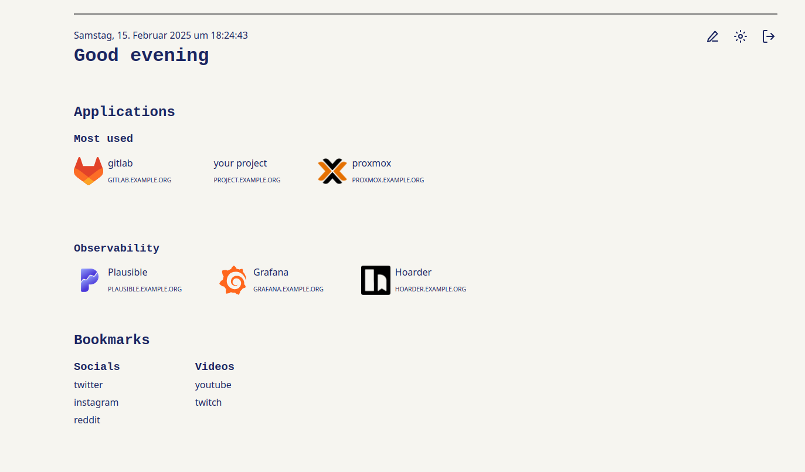
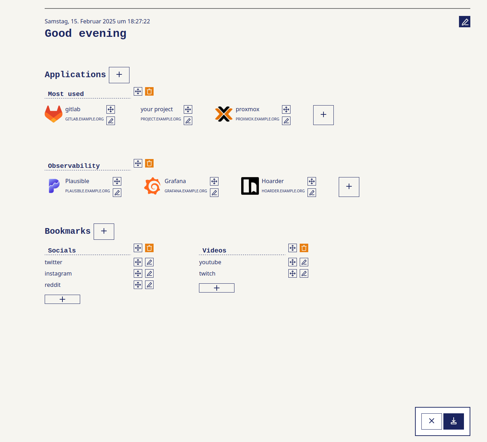
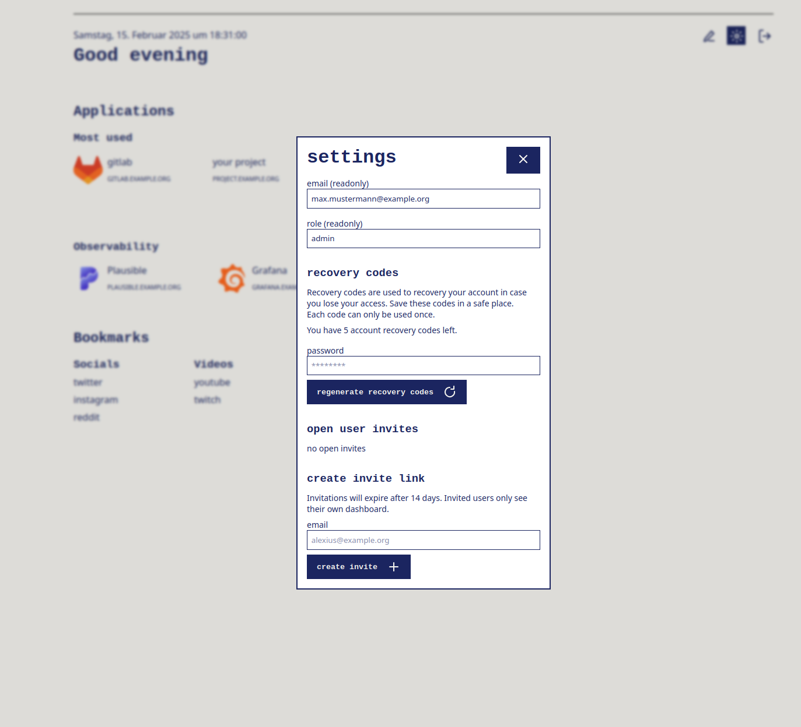

# Zentara: control with clarity

Zentara is a simple and intuitive dashboard for your applications and bookmarks. It is designed to be easy to use, understand, and edit, while looking good.
It does not seek to offer a lot of features, but rather to offer a few features that are well thought out and work well together. Self-hosted, open-source, and privacy-focused.

# notice

Zentara is in a usable state but still in development.

## features

There are essentially two types of elements in your dashboard: applications and bookmarks.
Applications consist of an icon (optional), a title, and a link, while bookmarks stay simple with just a title and a link. These two types of elements can be organized in groups, see for yourself:



## edit mode

When you enter the edit mode, you can move elements around (drag & drop), add new elements, and edit existing elements. You can save the edited state or cancel the edit mode with the buttons in the bottom right corner.



## settings

There is a minimal settings page with self-explanatory options.



## installation

Because of the simple architecture, Zentara should be easy to install on any server that supports Node.js. A Dockerfile and a docker compose configuration are also provided.

### docker

Use the `-d` flag to run the container in the background.

```bash
docker run -p 3000:3000 -e ZENTARA_ORIGIN="https://zentara.example.org" ghcr.io/moritzloewenstein/zentara/zentara:latest
# Listening on http://0.0.0.0:3000
```

### docker compose

Copy the provided docker-compose.yml, use the `-d` flag to run the container in the background.

```bash
# ZENTARA_ORIGIN env var is the domain of your Zentara instance
docker compose up
# Listening on http://0.0.0.0:3000
```

### building and running with node

To deploy this with a domain, you will need to configure the reverse proxy to point to the port that Zentara is running on. The default port is 3000.

```bash
export ORIGIN="https://zentara.example.org"
npm run build
node build/index.js
# Listening on http://0.0.0.0:3000
```

## security

When I went looking for a sleek server dashboard, missing login systems in other dashboards were a big reason for starting Zentara. I am not a security expert, but I tried to follow best practices and keep the code as simple as possible. If you find a vulnerability, please report it to me as soon as possible. Here are some of the security features of Zentara:

- **first user**: When you start Zentara for the first time, you will be asked to create a user. This user will be the only user with admin rights, and the only user who can create invite links for new users on the same instance (each user has their own dashboard). There is currently no way to create a new admin user, or promote an invited user to admin.
- **password hashing**: Zentara uses the argon2 algorithm to hash passwords. This is a widely used and secure algorithm.
- **session expiry**: Zentara uses a session inactivity timeout of one day and a session lifetime of one week. This means that you will be logged out after one day of inactivity and after one week of activity. This is longer than most websites, but I think it is a good compromise between security and convenience.
- **recovery codes**: Zentara offers the possibility to use recovery codes. These codes can be used to set a new password when you have lost your access. They can only be used once. Recovery codes can be regenerated at any time, but only if you have access (re-authentication). You can check how many recovery codes you have left at any time.
- **invite links**: Zentara offers the possibility to generate invite links for new users. New users will have their own dashboard, they can not watch your dashboard! You can see the open invites at any time. Invite links will expire after 14 days and can only be used once to create an account with the same email that they were created with.

## architecture

Zentara is a SvelteKit application with an SQLite database (`/data` folder). On the client side every unauthenticated request (and the global error state) lands on `+error.svelte`, while the dashboard lives in `+page.svelte`. It uses form actions for more or less everything, which are defined in `+page.server.js`. The filenames in the `$lib/server` folder accurately describe what they do, most handle the logic of the sqlite table with the respective name.

## contributions

Zentara's core intent is to stay simple and focused. If you have an idea for a new feature, please open an issue first to discuss it. If you want to contribute a bugfix, please fork the repository and open a pull request. I will review it as soon as possible (which might not be very soon, but I will try my best). The underlying philosophy can be seen in the following decisions i made:

- Zentara only uses SQLite as a database. This is a simple and lightweight database that is easy to use and understand. It is not as powerful as other databases, but it is more than enough for Zentara.
- Zentara does not send emails. For user management, Zentara uses invite links and recovery codes. This is a simple and secure way to avoid emails. If you create an invite link, you will have to send it to the new user yourself. If you lose your password, you can use a recovery code to set a new one.
- Zentara does not offer user defined styles. The design is simple and clear, and I intend to keep it that way. If you want to change the design, you will have to fork the repository and change the code yourself.
- Zentara does not offer much beyond a simple greeting and the dashboard. If you want to add more features, you will have to fork the repository and change the code yourself.
- Zentara only offers one configuration option: it is recommended to set the `ZENTARA_ORIGIN` environment variable to the domain of your Zentara instance.
